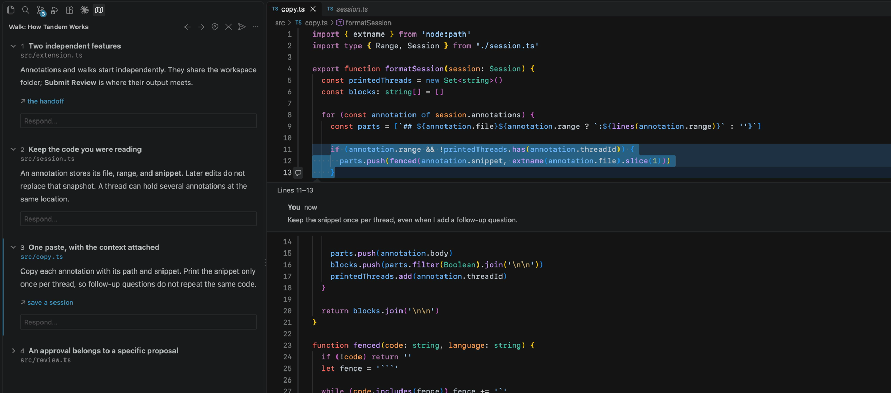
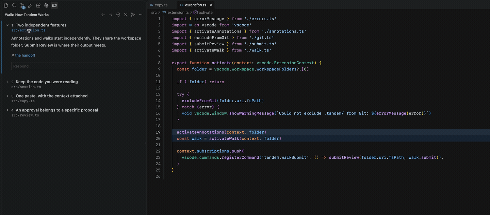
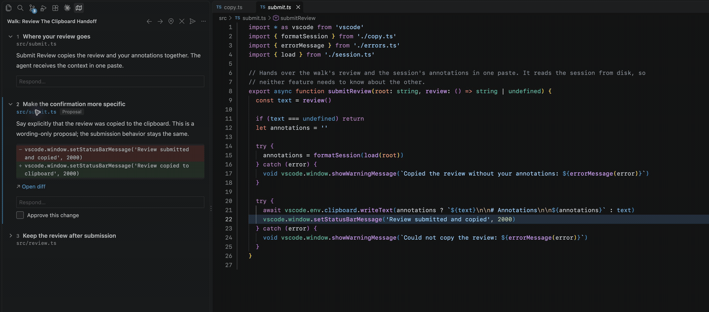

# Tandem

Tandem lets you annotate code in VS Code and follow walks through it written by a coding agent. Collect questions as you read, review proposed changes beside the code, and copy your annotations and review back to the agent.

## Installation

Install [Tandem from the Visual Studio Marketplace](https://marketplace.visualstudio.com/items?itemName=saiashirwad.tandem), or run:

```sh
code --install-extension saiashirwad.tandem
```

Requires VS Code 1.138 or later and a trusted workspace folder on disk. In a multi-root workspace, Tandem uses the first folder. Virtual workspaces and vscode.dev are not supported.

## Annotations

Select some code and press **Alt+A**. Type your annotation and press Enter to save it. Annotations appear as native comment threads beside the code and in VS Code's **Comments** panel.



- To add to an existing thread, place the cursor inside its range with nothing selected and press **Alt+A**.
- To annotate a whole file, use **Annotate File** in the editor title bar or the explorer context menu.
- To edit or delete an annotation, use the buttons on the annotation.

Run **Copy Tandem Session** to copy all your annotations, with file paths and code snippets, ready to paste into an agent. Snippets keep the code as it was when you annotated it, even if the file changes later.

**Clear Tandem Session** deletes all annotations. Both commands are available in the Comments panel title bar and the command palette.

## Walks

A walk is a sequence of steps an agent writes to explain code, propose changes, or both. Each step can point to code in your project, include a diagram, and link to other files.

To try one, give your agent this prompt:

> Write a Tandem walk explaining this project's main execution path. Follow https://github.com/saiashirwad/tandem/blob/main/WALKS.md and save it to `.tandem/walk.json`. Use a few focused steps with real file paths and unique, exact code quotes.

Open **Walk** in the activity bar. Click a step to open its file and highlight the relevant code, or use **Alt+]** and **Alt+[** to move between steps. Tandem remembers your place when you leave and come back. Saving a new version of the walk updates the view.



The [example walks](./docs/walks/README.md) follow Tandem's own source code.

### Reviewing proposals

A proposal describes a change the agent intends to make. If it includes a diff, **Open diff** opens it in VS Code's diff editor. Viewing or approving a proposal does not change your files.

Use **Approve this change** to approve a proposal, or press **Alt+Enter** on the focused step. You can write a response below any step, whether it proposes a change or explains existing code.



When you're done, **Submit Review** copies your approvals, responses, and annotations to the clipboard. Paste them back into the agent. The review is also saved to `.tandem/review.json` for the agent to read.

Your review survives reloads. When the agent revises a walk, responses follow their steps and changed proposals lose their approvals. Submitting a review clears nothing.

Tandem works through workspace files and copied text. The extension needs no agent account or API key. See [Writing walks](./WALKS.md) for the format and instructions for agents.

### Agent skill

The companion [Tandem skill](./skills/tandem/SKILL.md) teaches agents to write explanations and proposals, interpret reviews and annotations, and revise walks while preserving the reader's place. Copy the entire `skills/tandem/` folder into your agent's skills directory, including `references/` and `scripts/`. For example, Claude Code project skills live in `.claude/skills/tandem/`.

Then ask: “Use Tandem to explain the request path,” “Propose this refactor as a Tandem walk,” or “Read my Tandem review and address each response.”

The skill includes a read-only [authoring validator](./skills/tandem/references/walk-format.md#validation) for the walk format, source anchors, and proposed diffs. It requires Python 3.9+ and no extra packages.

## Commands

Commands are available in the command palette under **Tandem**.

| Command              | Shortcut  | Action                                    |
| -------------------- | --------- | ----------------------------------------- |
| Annotate Selection   | Alt+A     | Annotate code or add to a thread          |
| Annotate File        |           | Annotate the whole file                   |
| Copy Tandem Session  |           | Copy all annotations with their snippets  |
| Clear Tandem Session |           | Delete all annotations                    |
| Next Step            | Alt+]     | Focus the next step                       |
| Previous Step        | Alt+[     | Focus the previous step                   |
| Go to Current Step   |           | Return to the focused step's code         |
| Unfocus Step         |           | Remove the code highlight                 |
| Toggle Approval      | Alt+Enter | Approve or unapprove the focused proposal |
| Submit Review        |           | Save and copy the review with annotations |
| Clear Walk           |           | Delete the walk and its review            |

## Workspace data

Tandem stores its files in `.tandem/` at the workspace root:

- `session.json` — your annotations.
- `walk.json` — the agent's walk.
- `review.json` — your approvals and responses.

Tandem adds this folder to `.git/info/exclude`, leaving your project's `.gitignore` unchanged. Clearing annotations leaves the walk alone; clearing the walk leaves annotations alone.

## Development

Install Node.js 24 or later and [Bun](https://bun.sh/) 1.4.0, then run:

```sh
bun install --frozen-lockfile
bun run build
```

Press **F5** to open an Extension Development Host. To use the extension in your regular window, run **Developer: Install Extension from Location…** and select this folder. Run `bun run watch` while editing, then **Developer: Reload Window** after rebuilding.

`bun run package` runs type, lint, and formatting checks and builds a self-contained VSIX in `dist/`. Install it with **Extensions: Install from VSIX…**. Users do not need Bun or a separate Node.js installation. CI also produces a downloadable VSIX on pushes to `main` and pull requests.

Before releasing, try annotations, walks, diagrams, diffs, review submission, and persistence after reload in a fresh VS Code profile, including on the minimum supported version. Upload updates through the [Marketplace publisher page](https://marketplace.visualstudio.com/manage).

## Feedback

[Report a bug or request a feature](https://github.com/saiashirwad/tandem/issues).

## License

[MIT](./LICENSE)
